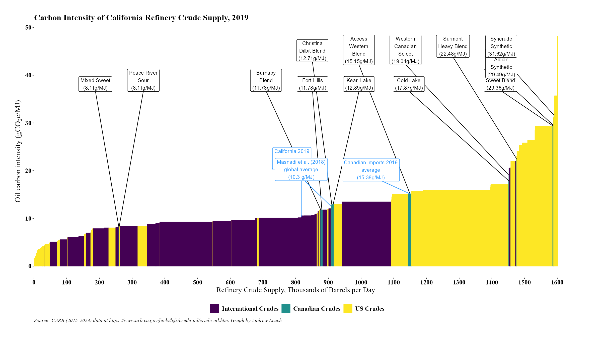

## California Crude Oil Lifecycle Emissions Intensities

As part of its [low-carbon fuel standard](https://ww2.arb.ca.gov/our-work/programs/low-carbon-fuel-standard), California refineries must account for the upstream emissions of the crude they process. This is assessed on the basis of emissions estimates by crude stream, with [annual reports available here](https://ww2.arb.ca.gov/resources/documents/lcfs-crude-oil-life-cycle-assessment). Unfortunately, the reports are only available in PDF, so I built a scraper and compiled some of the Canadian crude emissions intensities in this repo.

The most recent data are here:

